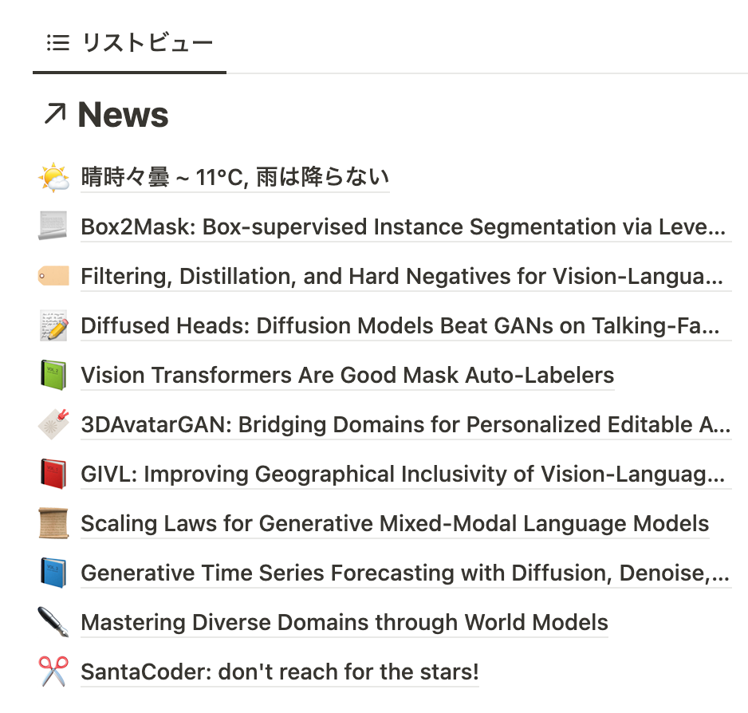

# notion-news

  

## Description

スケジューラから毎日実行させることで、Notionのデータベースに

1. 今日の気象情報
2. [@_akhaliq](https://twitter.com/_akhaliq)さんがツイートしたArxiv論文のアブストラクト日本語訳

を表示することができるスクリプトです。

## Installation

1. このリポジトリを`clone`し、プロジェクトルート下に`.env`ファイルを作成

2. Notionで新しいデータベースを**ページで**作成し、データベースのIDを`DATABASE_ID`として`.env`に記入する
    * **データベースのカラムは、必ず以下の3つである必要があります。**
      1. `Name`: データベースに保存されるページのタイトル
      2. `Tags`: ページに付与されるタグ、種類は`マルチセレクト`
      3. `URL`: ページの参照URL、種類は`URL`
    * **必ず新しいデータベースを作成してください。スクリプトは実行されるたびにデータベース内のページを削除する処理になっています。**

3. Notionで[インテグレーション](https://www.notion.so/my-integrations)を作成してデータベースに`コネクト`し、インテグレーションのアクセストークンを`NOTION_ACCESS_TOKEN`として`.env`に記入する

4. Twitterで新しい[Development App](https://developer.twitter.com/en/portal/dashboard)を作成し、以下を`.env`に記入する
    * `TWITTER_API_KEY`, `TWITTER_API_SECRET`: "API Key and Secret"で生成できるキー
    * `TWITTER_BEARER_TOKEN`: "Bearer Token"で生成できるトークン
    * `TWITTER_ACCESS_TOKEN`, `TWITTER_TOKEN_SECRET`: "Access Token and Secret"で生成できるトークン

5. 実行環境を作成する
    * Docker
      1. `docker build . -t notion-news`
      2. `chmod +x ./docker_run.sh && ./docker_run.sh`
    * 素の環境
      1. `pyenv local 3.9.11`
      2. `python -m venv venv`
      3. `source venv/bin/activate`
      4. `npm install`
      5. `automation.sh`の1行目のパスを、リポジトリをクローンした位置に書き換える
      6. `chmod +x ./automation.sh`

6. 任意のスケジューラに毎日`automation.sh`を実行させる
